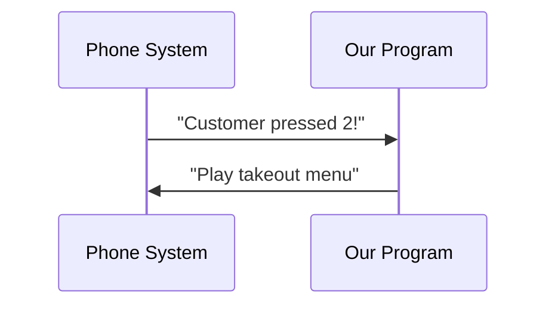

# Chapter 1: Telephony Event Handling

Welcome to your first adventure in the Zenda-code project! 🎉 Today we'll learn how phones and computers work together like a team of superheroes 🦸♂️🦸♀️ - starting with **Telephony Event Handling**.

## Why Do We Need This?

Imagine you're building a smart phone system for a pizza shop 🍕. When a customer calls:
1. The phone rings (📞 *ring ring!*)
2. Someone answers ("Pizza Palace, how can I help?")
3. Customer presses numbers to choose options ("Press 1 for delivery")
4. Call ends

Telephony Event Handling is like having a super assistant who whispers in your ear whenever these phone activities happen. This helps our program react instantly - like automatically sending a confirmation text when a call ends!

## Key Concepts Made Simple

### 1. Phone Activities = Events
Think of events as text messages from the phone system:
```csharp
// When a call starts
public class StasisStartEvent : Event
{
    public Channel Channel { get; set; } // <-- The phone line being used
}

// When someone presses a phone button
public class ChannelDtmfReceivedEvent : Event
{
    public string Digit { get; set; } // <-- Which button was pressed (e.g., "5")
}
```

### 2. Listening for Events
Our program sits ready like a security guard with a walkie-talkie 🚨. When an event happens:
```csharp
// Pseudocode example:
if (newEvent is StasisStartEvent startEvent)
{
    Console.WriteLine($"Call started on {startEvent.Channel.Id}!");
}
```

### 3. Reacting to Events
Here's how we handle a customer pressing "2" for takeout:


## Let's Build a Pizza Hotline! 🍕

Here's how we handle phone button presses (DTMF tones):

```csharp
// When someone presses a phone button
void HandleDtmf(ChannelDtmfReceivedEvent dtmfEvent)
{
    switch(dtmfEvent.Digit)
    {
        case "1":
            PlayMessage("delivery.mp3");
            break;
        case "2":
            PlayMessage("takeout.mp3");
            break;
    }
}
```

This code works like a pizza menu robot 🤖:
- Press 1 ➡️ "Our drivers are on the way!"
- Press 2 ➡️ "Your takeout will be ready in 20 minutes!"

## Behind the Scenes Magic 🔮

Here's what happens when a call starts:
1. Phone system sends a `StasisStartEvent`
2. Our program receives it like an email
3. We check the event type and channel details
4. We decide what to do next (play message, route call, etc.)

Looking at the actual code structure:
```csharp
// From StasisStartEvent.cs
public class StasisStartEvent : Event
{
    public List<string> Args { get; set; } // Any extra info
    public Channel Channel { get; set; }    // The phone line
}
```

This is like getting a package 📦 with:
- A label saying "NEW CALL" (event type)
- Contents listing which phone line is used (channel)
- Any special instructions (arguments)

## You Did It! 🎉

Now you understand the basics of telephony events! We've learned:
- Phone systems send event notifications
- Our program listens and reacts to them
- Different events help track call progress
- We can build smart responses using these events

Ready to learn how to organize these reactions into proper workflows? Let's move to [Chapter 2: Call Workflow Engine](02_call_workflow_engine_.md) where we'll make our pizza robot even smarter! 🚀

---

Generated by [AI Codebase Knowledge Builder](https://github.com/The-Pocket/Tutorial-Codebase-Knowledge)