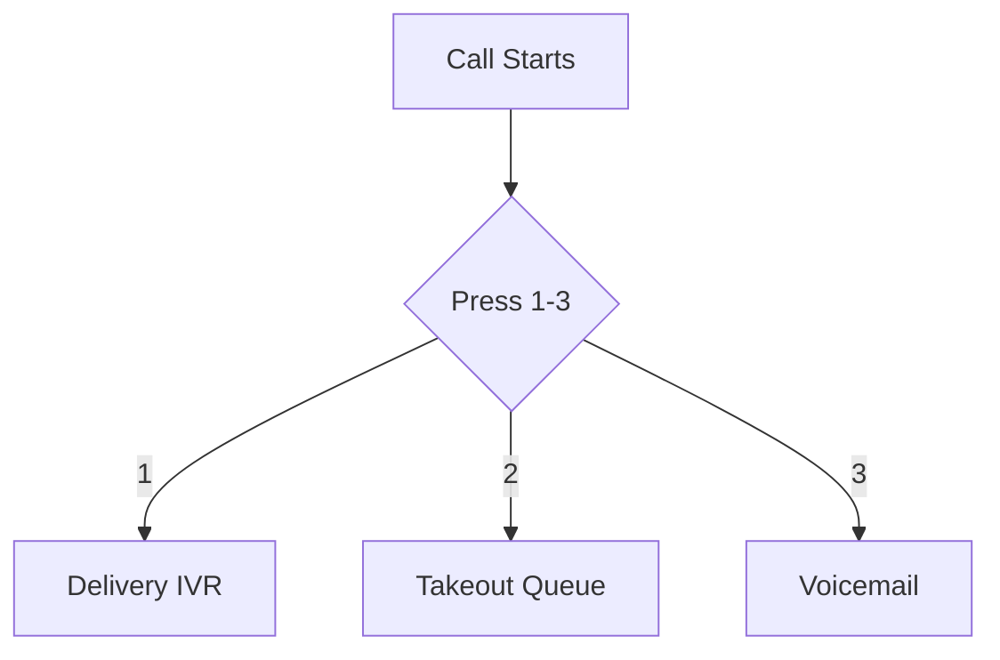
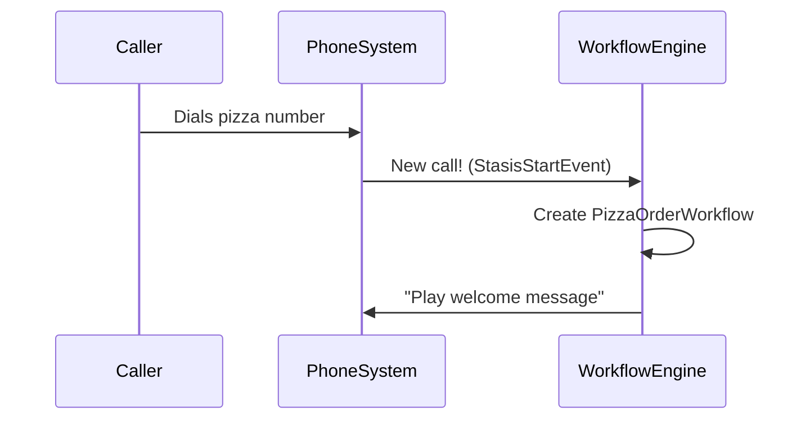

# Chapter 2: Call Workflow Engine

Welcome back! In our pizza shop phone system story 🍕📞, we just learned how to *react* to phone events. Now let's learn how to *organize* those reactions - like turning random ingredients into a perfect pizza recipe!

## From Chaos to Order

Imagine handling 100 pizza orders at once without a system! Our current event handling is like getting random ingredients thrown at us:
- "Customer pressed 1!"
- "New call started!"
- "Call ended!"

The **Call Workflow Engine** is like a pizza chef 🧑🍳 that organizes these ingredients into proper recipes. It manages complex call paths like:



## Key Concepts Made Tasty

### 1. Workflows = Pizza Recipes
Each call scenario gets its own "recipe":
- `WorkflowIVR`: Handles menu choices
- `WorkflowQueue`: Manages waiting lines
- `WorkflowVoicemail`: Records messages

### 2. State Machine = Cooking Steps
Like following recipe steps:
1. Preheat oven (Answer call)
2. Add toppings (Play menu)
3. Bake (Transfer call)

Here's a simple workflow starter from the code:
```csharp
public class WorkflowManager
{
    public async Task StartWorkflow(AriChannel channel)
    {
        // Simplified example:
        if (callIsPizzaOrder)
        {
            await StartWorkflow(new PizzaOrderWorkflow(channel));
        }
    }
}
```
This code acts like a kitchen manager deciding which chef handles each order.

## Let's Make a Pizza Order Workflow! 🍕

When someone calls our pizza shop:


Here's how we handle menu choices:
```csharp
public class PizzaWorkflow : WorkflowBase 
{
    protected override async Task HandleDtmf(string digit)
    {
        switch(digit) 
        {
            case "1": await PlayDeliveryMenu(); break;
            case "2": await TransferToQueue(); break;
            case "3": await RecordVoicemail(); break;
        }
    }
}
```

## Inside the Workflow Kitchen 🔍

Let's peek at how IVR menus work using the provided code:

```csharp
// Simplified IVR processor
public class IvrProcessorPlay 
{
    public async Task Process() 
    {
        // Play "Press 1 for delivery" 
        await Channel.PlayPrompt("delivery_menu.mp3");
        
        // Wait for button press
        var choice = await WaitForDtmf();
        
        // Handle choice
        if (choice == "1") StartDeliveryWorkflow();
    }
}
```
This works like a pizza order form:
1. Ask for crust type
2. Wait for selection
3. Move to next step

## Real-World Example: Failed Order

What if someone dials an invalid number? The engine handles it gracefully:
```csharp
private async Task CreateWorkflow()
{
    if (invalidNumber)
    {
        return new WorkflowError(
            playMessages: [Sounds.DestInvalid, Sounds.Goodbye]
        );
    }
}
```
This plays: "Invalid option. Goodbye!" 📞❌

## You Built a Pizza Workflow! 🎉

**What we learned:**
- Workflows organize call handling like recipes
- Different workflows handle different scenarios
- The engine manages transitions between states
- Error handling keeps calls smooth

Ready to meet the "ingredients" these workflows use? Let's move to [Chapter 3: Managed Telephony Objects](03_managed_telephony_objects_.md) where we'll learn about calls, queues, and voicemail boxes! 🧑🍳➡️📦

---

Generated by [AI Codebase Knowledge Builder](https://github.com/The-Pocket/Tutorial-Codebase-Knowledge)