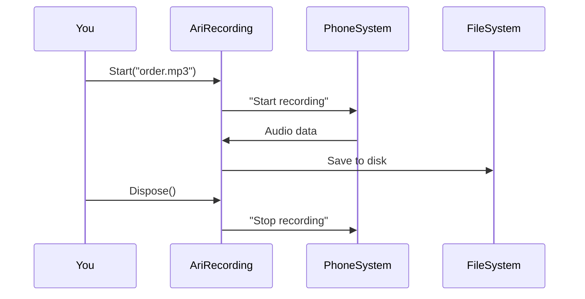

# Chapter 3: Managed Telephony Objects

Welcome back, pizza tech wizard! 🧙♂️ In our last chapter, we learned how workflows organize call handling like pizza recipes. Now let's meet the special ingredients these recipes use: **Managed Telephony Objects** - your pre-made pizza dough and sauce that make building phone systems easier!

## Why We Need Supercharged Phone Tools

Imagine trying to make 100 pizzas while still growing wheat and tomatoes 🌾🍅. That's what working with raw phone system resources feels like! Managed Telephony Objects give us ready-to-use ingredients:

**Problem Before:**
```csharp
// Without managed objects:
StartRecording();
// Oh no! Need to remember to:
// 1. Check storage space
// 2. Handle errors
// 3. Stop recording when done
// 4. Save file properly
```

**Solution After:**
```csharp
// With managed objects:
using var recording = StartManagedRecording();
// Automatic cleanup!
// - Stops when disposed
// - Handles errors
// - Saves properly
```

## Meet Your Phone System Helpers 🦸

Here are our four superhero objects (like pizza-making tools):

| Object          | Real-Life Equivalent      | Superpower                          |
|-----------------|---------------------------|-------------------------------------|
| `AriChannel`    | Phone Line 📞             | Manages call connections            |
| `AriBridge`     | Conference Room 🏢        | Handles call merging                |
| `AriPlayback`   | Speaker System 🔊         | Plays audio messages                |
| `AriRecording`  | Tape Recorder ⏺️          | Manages call recordings             |

## Let's Record a Pizza Order! 🍕

Here's how simple recording becomes with managed objects:

```csharp
// Start recording when a call begins
async Task HandleNewCall(AriChannel channel)
{
    // Start recording - like pressing "record" 
    var recording = channel.Record("pizza_order.mp3");
    
    // Wait until call ends
    await channel.WaitForHangup();
    
    // Automatic cleanup! 
    recording.Dispose(); // Saved to "pizza_order.mp3"
}
```

This code:
1. Starts recording when call begins
2. Automatically stops when call ends
3. Handles file storage errors behind the scenes

## What's Happening Backstage? 🎭

When you create a managed recording:


## Peek Inside the Recording Toolbox 🔧

Let's look at part of the actual `AriLiveRecording` class (simplified):

```csharp
public class AriLiveRecording : IDisposable
{
    private bool _disposed;
    
    public void Dispose()
    {
        if (_disposed) return;
        StopRecording(); // Auto-stop magic!
        _disposed = true;
    }
    
    private void StopRecording()
    {
        // Saves file and cleans up
        PhoneSystem.StopRecording(Name);
    }
}
```

This "dispose" pattern works like a self-cleaning pizza oven 🧼 - it automatically cleans up resources when you're done!

## Real-World Example: Conference Call Pizza Party 🎉

Here's how we might handle a group order using `AriBridge`:

```csharp
async Task CreatePizzaConference(AriChannel caller)
{
    // Create conference room
    using var bridge = new AriBridge();
    
    // Add caller to conference
    bridge.AddChannel(caller.Id);
    
    // Add 3 colleagues
    bridge.AddChannel("SIP/manager");
    bridge.AddChannel("SIP/chef");
    bridge.AddChannel("SIP/driver");
    
    // Conference auto-cleans when done!
}
```

## You’ve Mastered Phone Ingredients! �

**What we learned:**
- Managed objects handle complex phone tasks
- Four main types simplify call management
- Automatic cleanup prevents resource leaks
- Error handling happens behind the scenes

Ready to learn how to actually *use* these objects? Let’s move to [Chapter 4: ARI Action Interfaces](04_ari_action_interfaces_.md) where we’ll learn to control our phone tools like a pro! 🕹️

---

Generated by [AI Codebase Knowledge Builder](https://github.com/The-Pocket/Tutorial-Codebase-Knowledge)