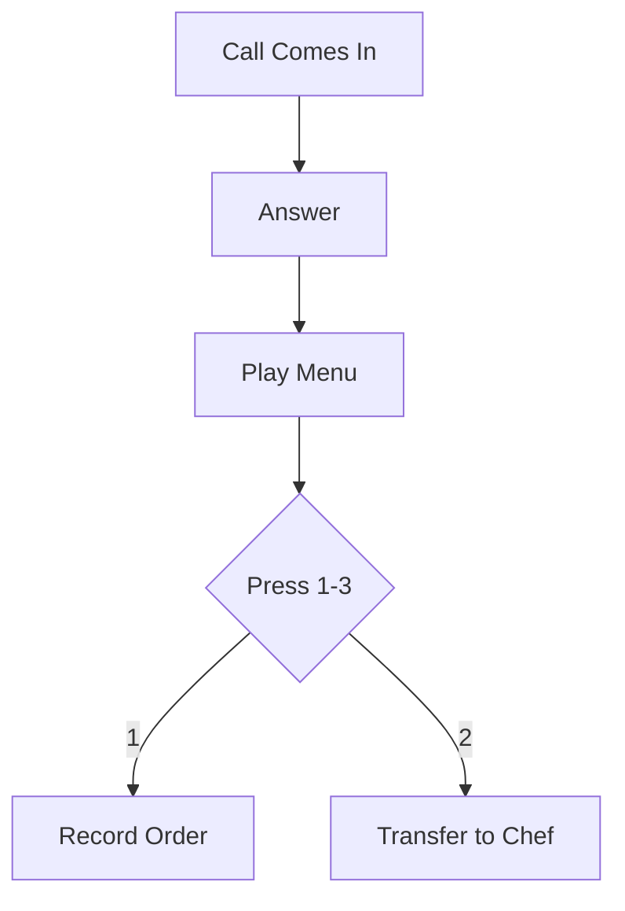
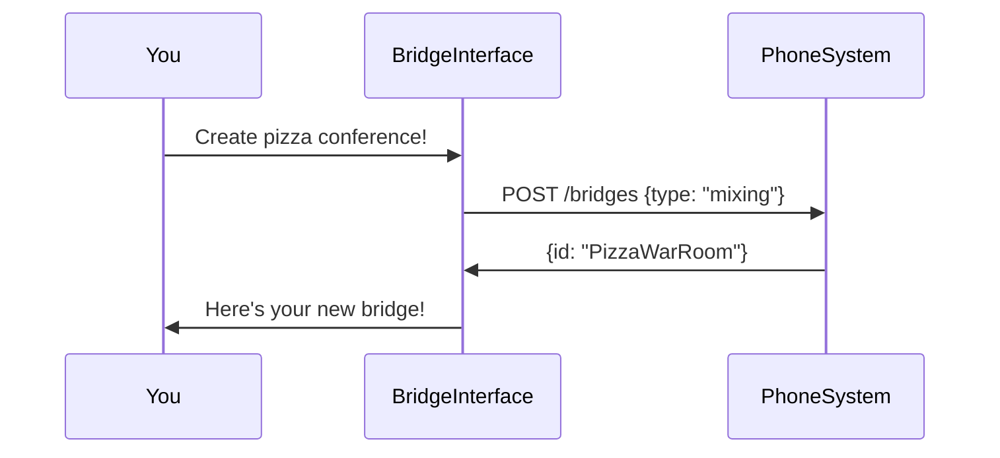

# Chapter 4: ARI Action Interfaces

After learning about our phone system "ingredients" (Managed Telephony Objects) in [Chapter 3](03_managed_telephony_objects_.md), let's learn how to actually *use* them! Meet **ARI Action Interfaces** - your phone system remote control! 🎮

## Why Do We Need These?

Imagine you're building a pizza order hotline 🍕📞. You need to:
1. Answer calls
2. Play menu options
3. Record orders
4. Transfer calls to chefs

Without ARI Actions, this would be like cooking with oven mitts on - possible but clumsy! These interfaces give you easy buttons for phone operations:



## Your Phone Control Panel 📟

There are 3 main types of actions:

1. **Bridge Actions** - Conference calls  
   (Like a pizza party phone line 🎉)
2. **Channel Actions** - Individual calls  
   (Single pizza order line 🍕)
3. **Device State Actions** - Phone status  
   (Is the chef's phone busy? 🚦)

Let's see them in action!

## Making a Pizza Conference Call

Here's how to create a bridge (conference room) using `IBridgesActions`:

```csharp
// Create a pizza team conference
async Task CreatePizzaTeamCall()
{
    var bridge = await bridges.CreateAsync(
        type: "mixing,holding", 
        name: "PizzaWarRoom"
    );
    
    // Add manager and chef
    await bridges.AddChannelAsync(bridge.Id, "SIP/manager");
    await bridges.AddChannelAsync(bridge.Id, "SIP/chef01");
}
```

This code:
1. Creates a new conference room
2. Adds two phone lines to it
3. Automatically handles errors behind the scenes

## Handling a Customer Call

Here's a simple order taking flow using `IChannelsActions`:

```csharp
async Task HandleCustomerCall(Channel channel)
{
    await channels.AnswerAsync(channel.Id); // Pick up phone
    await channels.PlayAsync(channel.Id, "sound:welcome_menu.mp3");
    
    var choice = await WaitForButtonPress();
    if(choice == "1") 
    {
        await channels.RecordAsync(channel.Id, "order123", "wav");
    }
}
```

This is like a phone robot assistant:
- Answers immediately
- Plays your menu
- Records orders automatically

## Checking Phone Status

Using `IDeviceStatesActions` to see if phones are available:

```csharp
async Task CheckChefPhone()
{
    var chefPhone = await devices.GetAsync("SIP/chef01");
    
    if(chefPhone.State == "NOT_IN_USE")
    {
        Console.WriteLine("Chef is ready for calls! 👨🍳");
    }
}
```

## How It Works Behind the Scenes

When you call `bridges.CreateAsync()`, here's what happens:



The interface translates your C# code into phone system commands - like a translator between you and the telephone network! 🌐

## Peeking at the Bridge Remote Control

Here's a simplified version of the actual bridge interface from the code:

```csharp
public interface IBridgesActions
{
    // Creates a new conference bridge
    Task<Bridge> CreateAsync(string type, string name);
    
    // Adds phone line to bridge
    Task AddChannelAsync(string bridgeId, string channelId);
    
    // Plays audio to entire bridge
    Task<Playback> PlayAsync(string bridgeId, string audioFile);
}
```

Each method matches a specific phone system operation. There are similar interfaces for channels (`IChannelsActions`) and device states (`IDeviceStatesActions`).

## Real-World Example: Failed Order Recovery

What if a recording fails? The interfaces handle errors gracefully:

```csharp
try 
{
    await channels.RecordAsync(...);
}
catch (PhoneSystemException ex)
{
    await channels.PlayAsync("sound:error.mp3");
    await channels.HangupAsync();
}
```

This automatically:
1. Tries to record
2. Plays error message if it fails
3. Hangs up politely

## You’re Now a Phone System Pilot! 🚀

**What we learned:**
- Action interfaces are "remote controls" for phones
- Three main types handle different scenarios
- Methods map directly to phone operations
- Error handling keeps calls stable

Ready to meet the actual phone system "things" these interfaces control? Let’s move to [Chapter 5: ARI Entity Models](05_ari_entity_models_.md) where we'll learn about calls, bridges, and other phone objects! 📱➡️

---

Generated by [AI Codebase Knowledge Builder](https://github.com/The-Pocket/Tutorial-Codebase-Knowledge)