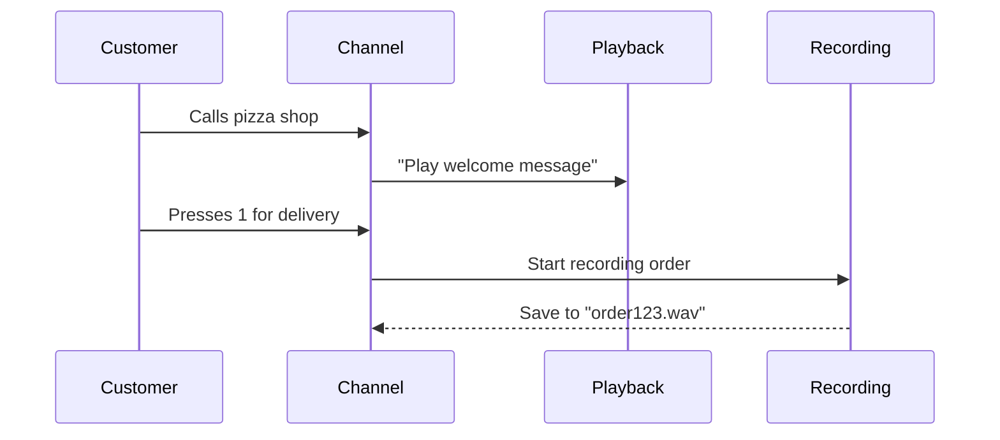
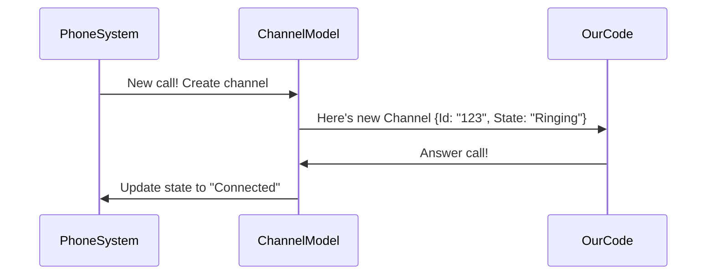

# Chapter 5: ARI Entity Models

After learning how to control phone systems with action interfaces ([Chapter 4](04_ari_action_interfaces_.md)), let's meet the phone system "characters" we're controlling! Meet **ARI Entity Models** - the digital puppets representing real phone activities! 🎭

## Why We Need Phone Puppets

Imagine running a pizza delivery call center 🍕📞. You need to track:
- Who's calling (👩💼 Customer)
- Where calls are happening (📞 Phone line)
- Recorded orders (⏺️ Tape recorder)
- Group calls (👥 Team meeting)

ARI Entity Models are like ID cards for these phone system elements. They help our program understand and manage real-world phone activities through code!

## Meet the Phone System Cast 🌟

Here are the main characters in our telephony play:

| Model          | Real-World Equivalent | Superpower                          |
|----------------|-----------------------|-------------------------------------|
| `Channel`      | Phone Call 📞         | Represents a single conversation    |
| `Bridge`       | Conference Room 🏢    | Manages merged calls                |
| `Playback`     | Speaker System 🔊     | Handles audio messages              |
| `Recording`    | Tape Recorder ⏺️      | Manages call recordings             |

## Pizza Order Example 🍕

Let's see how these models work together for a delivery order:



## Channel: The Phone Call Puppet

Here's what a simplified `Channel` model looks like:
```csharp
public class Channel
{
    public string Id { get; set; }      // Unique call ID: "PizzaCall-123"
    public string Name { get; set; }    // Technical name: "SIP/pizza-0001"
    public string State { get; set; }   // "Ringing", "Connected", "HungUp"
}
```

This is like a progress report for a phone call:
- `Id`: Call's social security number
- `Name`: Its official job title
- `State`: Current activity status

## Bridge: The Conference Room Manager

A conference bridge for team orders might look like:
```csharp
public class Bridge
{
    public string Id { get; set; }          // "DeliveryTeamConf"
    public List<string> Channels { get; set; } // ["CustomerCall", "ChefCall"]
    public string BridgeType { get; set; }  // "mixing" (merges audio)
}
```

This model helps track:
- Which calls are in the conference
- How audio is mixed
- Conference settings

## Behind the Scenes Magic 🔮

When a new call comes in:


The models act as messengers between our code and the real phone system!

## Peeking at the Puppet Strings

Let's look at part of the actual `Recording` model:
```csharp
public class LiveRecording
{
    public string Name { get; set; }    // "order_2023-08-01"
    public string Format { get; set; } // "wav" or "mp3"
    public int Duration { get; set; }   // 45 seconds
}
```

This helps us:
- Track recording length
- Manage file formats
- Handle storage names

## Real-World Example: Failed Delivery

What if a customer hangs up mid-order? The models help detect this:
```csharp
if (channel.State == "HungUp")
{
    Console.WriteLine($"Call {channel.Id} ended abruptly!");
    recording.Stop(); // Auto-saves partial recording
}
```

## You’re Now a Phone Puppeteer! 🎉

**What we learned:**
- Entity models represent real phone activities
- Four main types handle calls, conferences, audio, and recordings
- Models provide snapshots of phone system state
- They enable easy tracking and management of calls

Ready to learn how to combine these concepts into complete call tasks? Let’s move to [Chapter 6: Call Handling Tasks](06_call_handling_tasks_.md) where we’ll choreograph our phone puppets into a beautiful dance! 💃🕺

---

Generated by [AI Codebase Knowledge Builder](https://github.com/The-Pocket/Tutorial-Codebase-Knowledge)