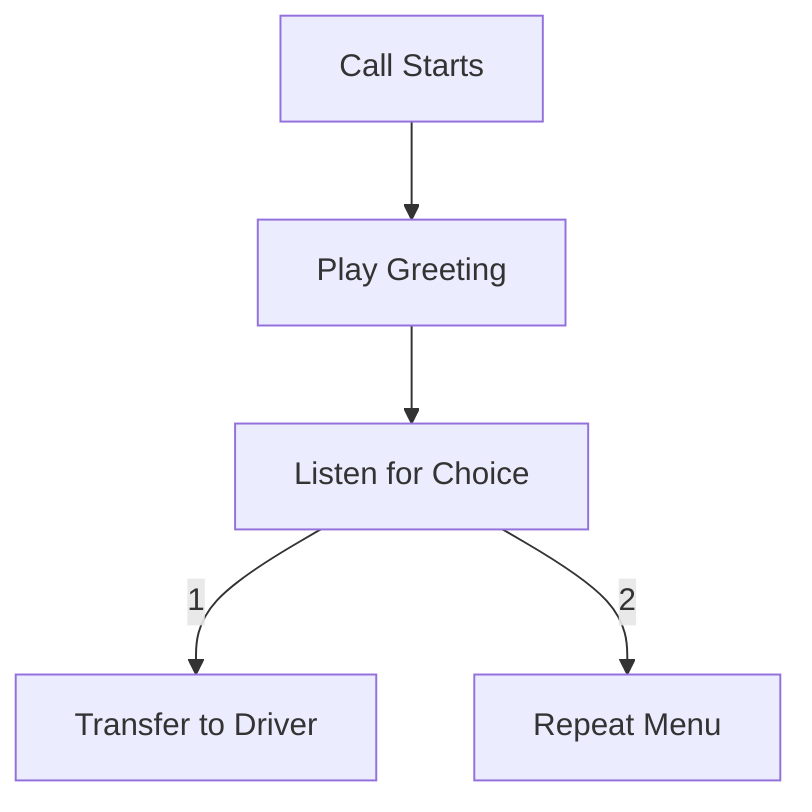
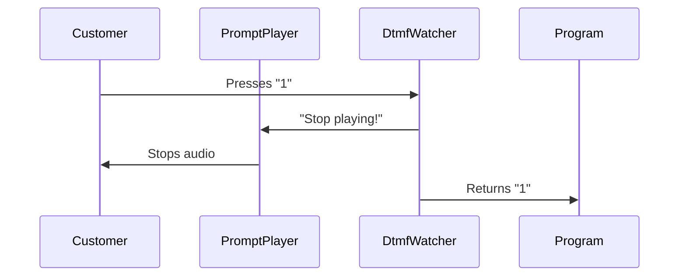

# Chapter 6: Call Handling Tasks

Welcome to the phone system control center! 🎛️ In our last chapter ([Chapter 5: ARI Entity Models](05_ari_entity_models_.md)), we met the "phone puppets" representing calls and recordings. Now let's learn how to make them dance together with **Call Handling Tasks** - your pre-built tools for handling common phone operations!

## Why We Need Phone Helpers

Imagine running a pizza delivery hotline during Friday rush hour 🍕📞. You need to:
1. Play greeting messages
2. Listen for menu choices
3. Transfer calls to drivers
4. Handle busy signals

Call Handling Tasks are like having a team of robot helpers 🤖 that handle these repetitive phone jobs automatically!



## Meet Your Robot Helpers 🦾

Here are three key helpers from our codebase:

| Task           | Real-Life Equivalent      | Superpower                          |
|----------------|---------------------------|-------------------------------------|
| `PromptPlayer` | CD Player 🔊              | Plays audio messages                |
| `DtmfWatcher`  | Security Guard 👮♂️       | Listens for phone button presses    |
| `Dialer`       | Robot Arm 🤖              | Makes outgoing calls                |

## Pizza Order Example 🍕

Let's build a simple order system:
```csharp
// When call starts
async Task HandlePizzaCall(AriChannel call)
{
    // Play greeting
    var player = new PromptPlayer(call, "sound:welcome.mp3", "123");
    await player.Start();
    
    // Listen for choice
    var dtmf = new DtmfWatcher(call, "123");
    var choice = await dtmf.Start();
    
    if(choice == "1") 
    {
        // Transfer to driver
        var dialer = new Dialer(driverNumber);
        await dialer.Start();
    }
}
```
This code:
1. Plays "Welcome to Pizza Palace!"
2. Waits for 1/2/3 button press
3. Transfers to driver if "1" is pressed

## CD Player for Your Phone: PromptPlayer

Here's how we play audio messages:
```csharp
// Play pizza menu options
var menuPlayer = new PromptPlayer(
    channel: call,          // The phone line
    prompts: "sound:menu.mp3", // Audio file
    termDigits: "123"       // Stop if 1/2/3 pressed
);

await menuPlayer.Start();  // Start playing!
```
This works like a CD player that:
- Plays "Press 1 for delivery"
- Automatically stops when buttons are pressed

## Phone Button Detective: DtmfWatcher

Here's how we listen for menu choices:
```csharp
var dtmfDetective = new DtmfWatcher(
    channel: call,     // The phone line
    termDigit: "#",    // Stop listening when # pressed
    waitTime: 10       // Timeout after 10 seconds
);

var result = await dtmfDetective.Start();
Console.WriteLine($"Customer pressed: {result.Dtmf}");
```
This helper:
- Listens for button presses
- Stops when # is pressed or timer expires
- Returns collected digits

## Call-Making Robot: Dialer

Here's how to call a driver:
```csharp
var pizzaDriverDialer = new Dialer(
    number: "555-PIZZA",  // Driver's number
    naSeconds: 25         // Wait 25 seconds for answer
);

var result = await pizzaDriverDialer.Start();
if(result == DialingResult.Answered) 
{
    Console.WriteLine("Driver picked up! 🚗");
}
```
This robot arm:
- Dials driver's number
- Waits 25 seconds
- Tells us if call succeeded

## Behind the Scenes Magic 🔮

When someone presses "1" during a message:


## Peek Inside the Helpers 🧐

Here's a simplified version of `PromptPlayer`'s stop mechanism:
```csharp
public class PromptPlayer : IDisposable
{
    private AriChannel _channel;
    
    public async Task Stop()
    {
        // Stop audio playback
        await _channel.StopPlaying();
        // Unsubscribe from button events
        _channel.DtmfReceived -= OnButtonPress;
    }
}
```
This ensures we clean up properly after stopping playback.

## Real-World Example: Busy Driver

What if all drivers are busy? The Dialer handles it:
```csharp
var result = await pizzaDriverDialer.Start();

switch(result)
{
    case DialingResult.Busy:
        PlayMessage("All drivers busy.mp3");
        break;
    case DialingResult.Answered:
        TransferCall();
        break;
}
```

## You’re Now a Phone Task Master! 🎉

**What we learned:**
- Call Handling Tasks simplify common operations
- Three main helpers handle audio, input, and dialing
- Tasks automatically manage complex phone operations
- Easy error handling keeps calls flowing smoothly

Ready to connect these calls to customer records? Let’s move to [Chapter 7: CRM Integration](07_crm_integration_.md) where we’ll save order details like a pro! 📁➡️📞

---

Generated by [AI Codebase Knowledge Builder](https://github.com/The-Pocket/Tutorial-Codebase-Knowledge)