# Chapter 7: CRM Integration

After learning how to handle phone tasks in [Chapter 6](06_call_handling_tasks_.md), let's make our pizza shop phone system smarter by connecting it to customer records! 🍕📁 **CRM Integration** is like giving your phone robot a photographic memory - it remembers every customer's favorite orders and history!

## Why Add Memory to Your Phone?

Imagine this pizza shop scenario:
1. Regular customer calls 📞
2. System recognizes their number
3. Screen pops up: "Welcome back Lisa! Last order: 2 pepperoni pizzas 🍕"
4. Agent says: "Hi Lisa! Same order as last time?"

Without CRM integration, every call starts from scratch. With it, we get super-powered customer service!

## Pizza Shop CRM Magic 🧙

Here's what our CRM integration can do:

```mermaid
sequenceDiagram
    participant Caller
    participant PhoneSystem
    participant CRM
    Caller->>PhoneSystem: Calls pizza shop
    PhoneSystem->>CRM: "Who's calling from 555-1234?"
    CRM->>PhoneSystem: "Lisa - VIP customer 🎖️, loves pepperoni"
    PhoneSystem->>Agent: Shows Lisa's info
```


## Key Ingredients for CRM Magic

### 1. Customer Lookup (The Phone Book 📖)
```csharp
var customer = await crm.GetCustomer("5551234");
Console.WriteLine($"Welcome back {customer.Name}!");
// Output: "Welcome back Lisa!"
```
This code checks the CRM system like looking up a number in your phone contacts.

### 2. Call Logging (The Diary 📔)
```csharp
await crm.OnCallAdded(callDetails);
```
Automatically writes call details to the CRM, like keeping a receipt for every order.

### 3. Screen Pop (The Flash Card 🎴)
```csharp
var customerUrl = crm.CreateOpenCustomerUrl("Lisa123");
OpenBrowser(customerUrl);
```
Opens the customer's CRM profile automatically when they call.

## Let's Build a Customer Greeter!

Here's how we recognize callers using the CRM interface:
```csharp
async Task HandleIncomingCall(string callerNumber)
{
    // Look up customer
    var customer = await crm.GetCustomer(callerNumber);
    
    if(customer != null)
    {
        PlayMessage($"Welcome back {customer.Name}!");
        ShowCustomerProfile(customer.Id);
    }
    else
    {
        PlayMessage("New customer! Let's get your details...");
    }
}
```
This code works like a receptionist who:
1. Checks caller ID against customer database
2. Personalizes the greeting for known customers
3. Starts new customer registration for unknowns

## Behind the Scenes: CRM Communication

When we check for a customer:


## Peeking at the CRM Toolbox 🧰

Here's a simplified version of the customer data model:
```csharp
public class CrmCustomer
{
    public string Id { get; set; }   // "Lisa123"
    public string Name { get; set; } // "Lisa Simpson"
    public string[] Phones { get; set; } // ["5551234", "5555678"]
}
```
This is like a digital contact card storing:
- Unique ID
- Customer name
- All associated phone numbers

## Real-World Example: VIP Treatment

Automatically route VIP customers to managers:
```csharp
var customer = await crm.GetCustomer(callerNumber);
if(customer.IsVip)
{
    TransferCallTo("manager-phone");
    ShowPopup("VIP CUSTOMER ALERT! ⭐");
}
```

## You’re Now a CRM Wizard! 🎩

**What we learned:**
- CRM integration connects calls to customer data
- Three main features: lookup, logging, and screen pop
- Customer models store important details
- Automatic call logging creates better records

Ready to turn all this data into insights? Let’s move to [Chapter 8: Reporting Framework](08_reporting_framework_.md) where we'll create pizza sales dashboards! 📊🍕

---

Generated by [AI Codebase Knowledge Builder](https://github.com/The-Pocket/Tutorial-Codebase-Knowledge)