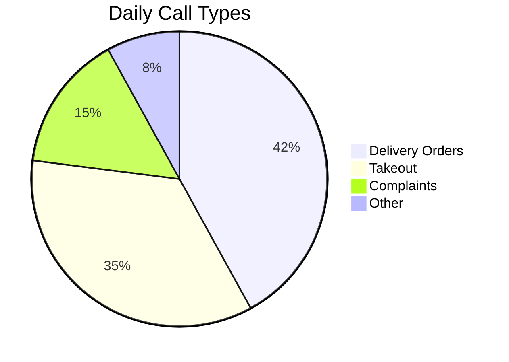
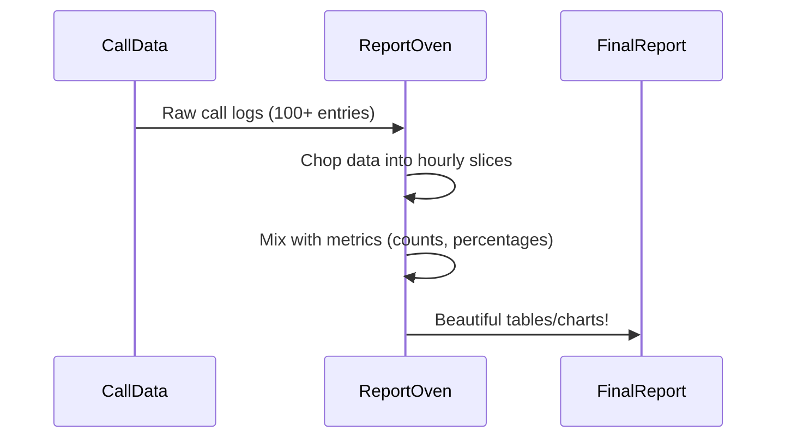

# Chapter 8: Reporting Framework

After learning how to track customer interactions in [Chapter 7: CRM Integration](07_crm_integration_.md), let's turn that data into delicious insights! 🍕📊 The **Reporting Framework** is like your pizza shop's smart oven - it takes raw call data and bakes it into perfect reports!

## Why We Need Data Chefs

Imagine trying to answer these pizza shop questions:
1. "Which toppings are most popular at lunch?"
2. "How many delivery calls go unanswered?"
3. "What's our busiest hour for takeout orders?"

Without reports, you're just guessing! Our framework helps create:



## Pizza Report Ingredients 🧑🍳

### 1. Report Types (Different Pizza Styles)
```csharp
public enum ReportCallTemplateType
{
    Detailed,        // Full call transcript
    Statistics,      // Numbers and percentages
    Grouped_Number,  // By phone number
    Summary_Status   // Call outcomes at a glance
}
```
Like choosing between deep-dish or thin-crust - each report style serves different needs!

### 2. Metrics (Pizza Toppings)
```csharp
public class CallMetrics
{
    public int Calls { get; set; }      // Total orders
    public int Answered { get; set; }   // Successful deliveries
    public int Abandoned { get; set; }  // Hung up calls
}
```
These are your basic ingredients for every report recipe!

### 3. Templates (Recipe Cards)
```csharp
public class IntervalMetricsReport : MetricsBaseReport
{
    // What to show in each column
    List<ReportTableField> Fields = new()
    {
        new() { Header = "Hour", Name = "IntervalString" },
        new() { Header = "Calls", Name = "Calls" },
        new() { Header = "Answered %", Name = "AnsRatioString" }
    };
}
```
This template decides how to present your call data - like formatting a menu!

## Let's Bake a Hourly Call Report! 🕒

Here's how we create a simple "Pizza Rush Hour" report:

```csharp
// 1. Gather call data
var lunchCalls = GetCallsBetween("11 AM", "2 PM");

// 2. Choose report style
var report = new IntervalMetricsReport(
    data: lunchCalls,
    title: "Lunch Time Calls",
    criteria: "11 AM - 2 PM"
);

// 3. Generate report
report.Generate();
```

This would create a table like:

| Hour | Calls | Answered % |
|------|-------|------------|
| 11 AM | 42    | 85%        |
| 12 PM | 68    | 72%        |
| 1 PM  | 55    | 80%        |

## Behind the Scenes: Report Kitchen 🧑🍳

When you generate a report:


## Peek Inside the Report Recipe

Here's a simplified version of the metrics calculation:
```csharp
// From IntervalMetricsReport.cs
void CalculateMetrics()
{
    foreach(var hour in callData)
    {
        metrics.Calls = hour.Calls.Count();
        metrics.Answered = hour.Calls.Count(c => c.Answered);
        metrics.AnsRatio = (metrics.Answered / metrics.Calls) * 100;
    }
}
```
This code works like a pizza calculator:
1. Count total calls per hour
2. Count answered calls
3. Calculate success percentage

## Real-World Example: Emergency Pepperoni Shortage! 🚨

When anchovy calls spike unexpectedly:
```csharp
var weirdCalls = GetCallsWithKeyword("anchovy");
var report = new GroupedReport(
    data: weirdCalls,
    groupBy: GroupType.CallerNumber
);

report.Show();
```
Output:
```
📞 555-1234 called 12 times about anchovies!
📞 555-5678 called 8 times about anchovies!
```

## You’re Now a Data Chef! 👩🍳

**What we learned:**
- Reports turn raw data into actionable insights
- Different report types serve different needs
- Metrics are the building blocks of analysis
- Templates control how data gets presented

Ready to display these reports in a web dashboard? Let’s move to [Chapter 9: Web Application Framework](09_web_application_framework_.md) where we'll build beautiful pizza data visualizations! 🖥️🍕

---

Generated by [AI Codebase Knowledge Builder](https://github.com/The-Pocket/Tutorial-Codebase-Knowledge)