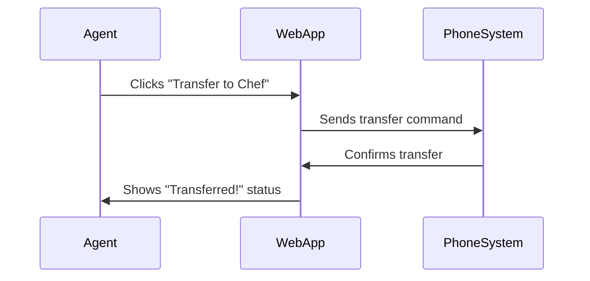
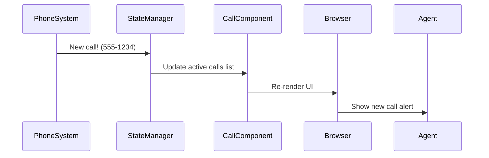

# Chapter 9: Web Application Framework

After learning how to create reports in [Chapter 8](08_reporting_framework_.md), let's build the digital control panel that displays them! 🖥️ The **Web Application Framework** is like your pizza shop's mission control - it creates the screens agents use to manage calls and view dashboards.

## Why Build a Web Interface?

Imagine trying to manage 100 pizza orders with just a telephone! 🍕📞 Our web framework lets agents:
1. See live calls on a dashboard
2. Access customer histories instantly
3. Transfer calls with button clicks
4. View real-time sales reports



## Your Digital Pizza Dashboard 🍕📊

The framework uses Blazor - like LEGO blocks for web interfaces. Key components:

### 1. UI Components (Digital Building Blocks)
```razor
<CallStatusDisplay Call="@currentCall" />
<CustomerProfile Customer="@selectedCustomer" />
```
These pre-built pieces handle common tasks like showing call durations or customer info.

### 2. State Management (Shared Notebook)
```csharp
public class CallState
{
    public List<Call> ActiveCalls { get; set; } // Live calls
    public event Action OnChange; // Notify when updates occur
}
```
This keeps all components synchronized, like a notebook everyone can read/write.

### 3. Telephony Integration (Phone-Web Bridge)
```csharp
protected override void OnInitialized()
{
    telephonyService.OnCallReceived += UpdateDashboard;
}
```
Connects web components to real phone events from [Chapter 1](01_telephony_event_handling_.md).

## Let's Build a Call Dashboard!

Here's a simplified version of the real softphone component:

```razor
@* Simplified Softphone.razor *@
<div class="call-panel">
    <h3>Current Call: @callNumber</h3>
    <button @onclick="TransferCall">Transfer to Chef</button>
    <CallDurationDisplay StartTime="@callStartTime" />
</div>

@code {
    [Inject] TelephonyService Telephony { get; set; }
    
    private void TransferCall()
    {
        Telephony.Transfer("CHEF_EXTENSION");
    }
}
```
This creates a panel that:
1. Shows current call number
2. Has a transfer button
3. Displays call duration timer

## Behind the Scenes Magic 🔮

When a new call arrives:


## Peeking at Component Wiring

Here's how state management works in `CallState.cs`:
```csharp
public class CallState
{
    public List<Call> ActiveCalls { get; } = new();
    
    public void AddCall(Call newCall)
    {
        ActiveCalls.Add(newCall);
        NotifyStateChanged();
    }

    private void NotifyStateChanged() => OnChange?.Invoke();
}
```
This is like a town crier shouting updates to all components whenever calls change.

## Real-World Example: CRM Pop-Up

When a regular customer calls from [Chapter 7](07_crm_integration_.md):
```razor
@if(currentCustomer != null)
{
    <div class="customer-popup">
        <h4>Welcome back @currentCustomer.Name!</h4>
        <p>Last order: 2 Pepperoni Pizzas</p>
    </div>
}
```
Automatically shows customer history when recognized!

## You’re Now a Web Framework Chef! 👨🍳

**What we learned:**
- Blazor components build interactive UIs
- State management keeps everything synchronized
- Telephony integration connects web/phone systems
- Dashboards display real-time information

Ready to learn how all these pieces communicate? Let’s move to [Chapter 10: Network Communication Layer](10_network_communication_layer_.md) where we'll explore the digital highways connecting your pizza shop systems! 🚀🌐

---

Generated by [AI Codebase Knowledge Builder](https://github.com/The-Pocket/Tutorial-Codebase-Knowledge)