# Chapter 10: Network Communication Layer

Welcome to the final piece of our pizza shop phone system! 🍕🔌 In [Chapter 9](09_web_application_framework_.md), we built a web dashboard - now let's connect it to the real world with the **Network Communication Layer**. This is like building the phone lines between your pizza shop and customers!

## Why We Need Communication Pipes

Imagine your web dashboard (from Chapter 9) and phone system (from Chapter 1) need to talk:

Without proper communication pipes:
- Messages get lost ❌
- Updates are delayed ⏳
- Systems can't understand each other 🤷

Our Network Layer solves this with two super-pipes:
1. **TCP**: Reliable delivery truck for Windows apps 🚚
2. **WebSocket**: Instant messenger for web browsers 💬

## Pizza Delivery Protocol 🍕📦

Let's see how a call transfer works:
```csharp
// Web dashboard sends transfer command
public async Task TransferToChef(string callId)
{
    await _network.SendCommand(
        channel: "call-commands",
        message: $"TRANSFER {callId} TO CHEF"
    );
}
```
This code works like a pizza order slip:
1. Write "Transfer call 123 to chef"
2. Put it in the "call-commands" envelope
3. Send through our network pipes

## Meet the Communication Crew 👷

### 1. TCP Server (The Delivery Truck)
Handles Windows app communication:
```csharp
// Simplified TCP server setup
var tcpServer = new TcpServer(port: 8080);
tcpServer.Start();
Console.WriteLine("Ready to deliver messages! 🚚");
```

### 2. WebSocket Connection (The Instant Messenger)
Handles browser communication:
```csharp
// WebSocket connection handler
websocket.OnMessage(message => 
{
    Console.WriteLine($"Received: {message} 📩");
});
```

### 3. Message Translator (The Bilingual Chef)
Ensures everyone understands each other:
```csharp
public string TranslateMessage(string rawMessage)
{
    return rawMessage switch
    {
        "TRANSFER" => "BeginCallTransfer",
        "HANGUP" => "EndCallProcedure",
        _ => rawMessage
    };
}
```

## Real-Time Pizza Updates 🕒

Here's how new calls appear instantly everywhere:

```mermaid
sequenceDiagram
    participant Phone
    participant NetworkLayer
    participant WebDashboard
    participant WindowsApp
    
    Phone->>NetworkLayer: "New call! (555-1234)"
    NetworkLayer->>WebDashboard: "📞 New call!"
    NetworkLayer->>WindowsApp: "📞 New call!"
```


## Peek Inside the Message Kitchen 👨🍳

When a message arrives at our TCP server:
```csharp
// Simplified message handling
void HandleTcpMessage(string message)
{
    var translated = TranslateMessage(message);
    
    // Send to all connected devices
    SendToWebClients(translated);
    SendToWindowsClients(translated);
}
```
This code works like a pizza kitchen manager:
1. Receives raw ingredients (message)
2. Prepares them (translation)
3. Sends to all stations (clients)

## Connection Heartbeat ❤️

What if a connection drops? Our layer automatically reconnects:
```csharp
// Simplified reconnection logic
async Task MaintainConnection()
{
    while(true)
    {
        if(!IsConnected())
        {
            await ConnectAsync(); // Like redialing a busy phone
        }
        await Task.Delay(5000);
    }
}
```

## You Built the Internet of Pizza! 🎉

**What we learned:**
- Network layer connects web/Windows apps to phone system
- TCP provides reliable Windows communication
- WebSocket enables real-time browser updates
- Message translation ensures everyone understands
- Automatic reconnection keeps systems talking

Congratulations! You've completed the full Zenda-code journey - from handling phone events to building real-time networks! 🚀 Why not revisit [Chapter 1](01_telephony_event_handling_.md) to see how far you've come?

---

Generated by [AI Codebase Knowledge Builder](https://github.com/The-Pocket/Tutorial-Codebase-Knowledge)