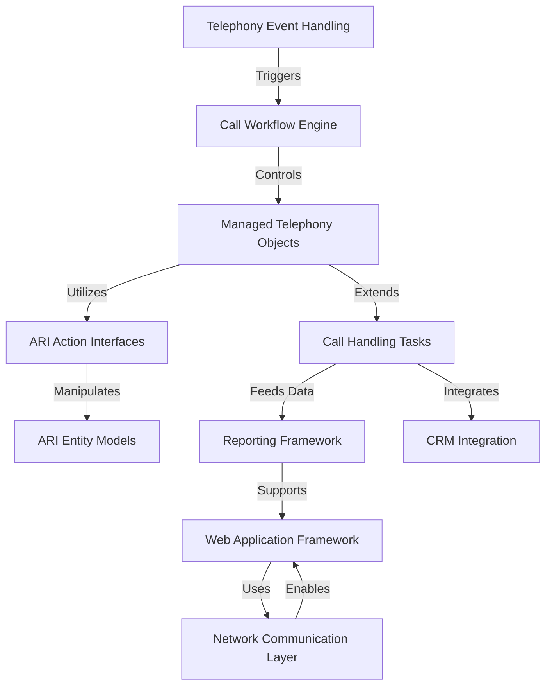

# Tutorial: zenda-code

**Zenda-code** is a *telecommunication system* built on Asterisk (PBX) that handles **real-time call processing**, **CRM integration**, and **agent dashboards**. It manages voice channels, bridges, recordings and implements IVR menus/queues while integrating with business data through CTI. The system provides web interfaces for agents/admins using Blazor and handles complex workflows like transfers and conferencing.

**Source Repository:** [None](None)

## Chapters

1. [Telephony Event Handling
](01_telephony_event_handling_.md)
2. [Call Workflow Engine
](02_call_workflow_engine_.md)
3. [Managed Telephony Objects
](03_managed_telephony_objects_.md)
4. [ARI Action Interfaces
](04_ari_action_interfaces_.md)
5. [ARI Entity Models
](05_ari_entity_models_.md)
6. [Call Handling Tasks
](06_call_handling_tasks_.md)
7. [CRM Integration
](07_crm_integration_.md)
8. [Reporting Framework
](08_reporting_framework_.md)
9. [Web Application Framework
](09_web_application_framework_.md)
10. [Network Communication Layer
](10_network_communication_layer_.md)

---

Generated by [AI Codebase Knowledge Builder](https://github.com/The-Pocket/Tutorial-Codebase-Knowledge)